## Getting Started

## Table of Contents

1. [Introduction](#introduction)
2. [Features](#features)
3. [Usage](#usage)
4. [Screenshots](#screenshots)
5. [Architecture](#architecture)
6. [API Reference](#api-reference)

## Introduction

The Vible Wallet Clone is a Flutter application that replicates the core functionalities of the Wallet Section in of the Vible App. It allows users to manage multiple wallets, view transaction history, and send/receive cryptocurrency across different networks.

## Features

- User authentication
- Wallet management
- Transaction history
- Send and receive cryptocurrency

## Usage

- **Authentication:** Log in with your registered credentials.
- **Wallet Management:** Create, view, and manage multiple wallets.
- **Transactions:** View transaction history and perform send/receive operations.
- **Network Selection:** Switch between different supported networks like Polygon Mainnet, Ethereum Mainnet, etc.

## Screenshots

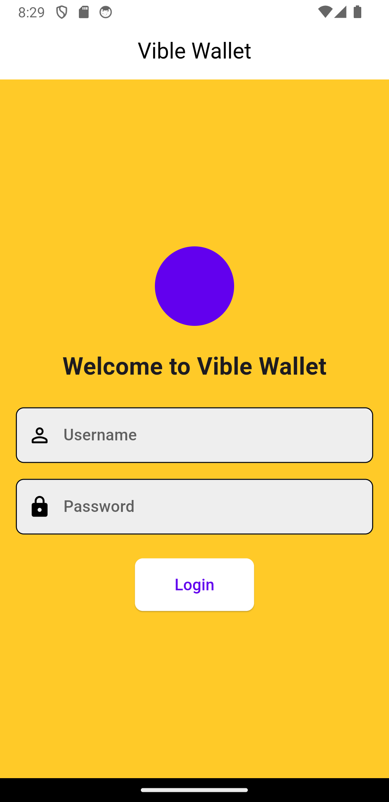
_Login Screen_

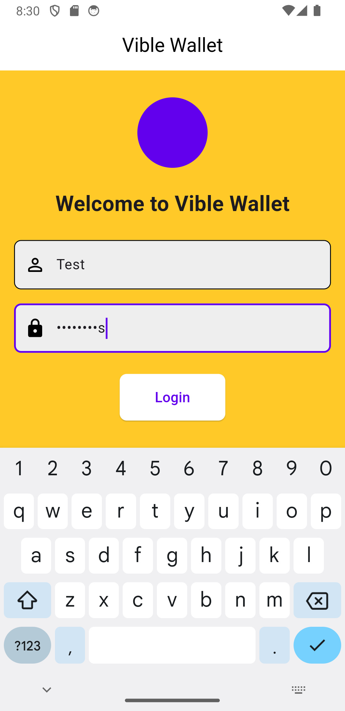
_Login Filled Screen_

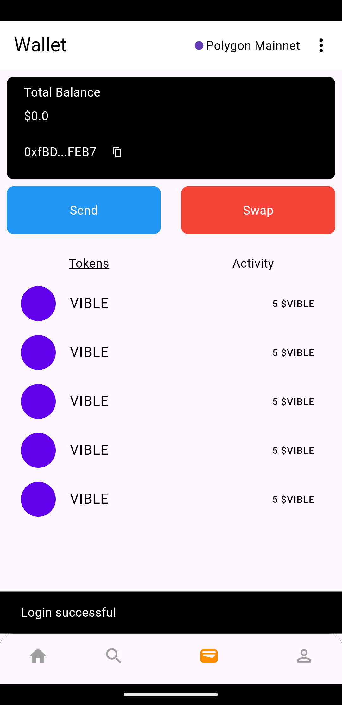
_Login Successful Screen_

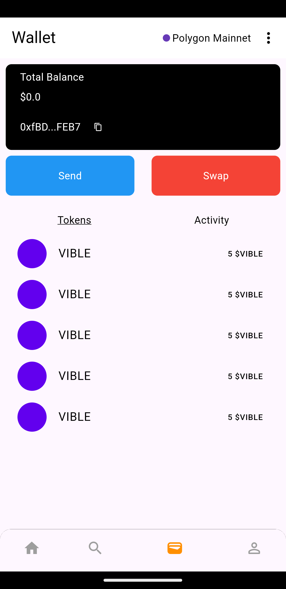
_Dashboard_

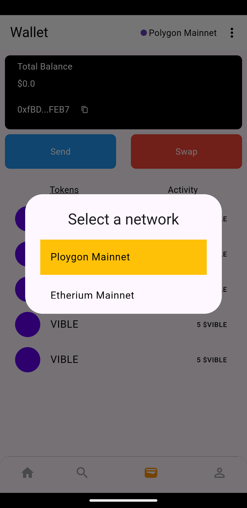
_Select Network_

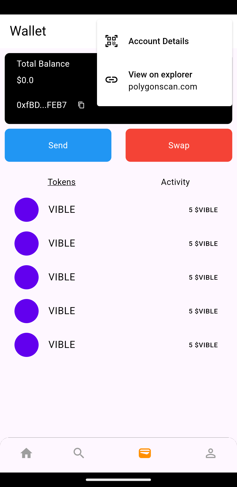
_View More From App Bar_

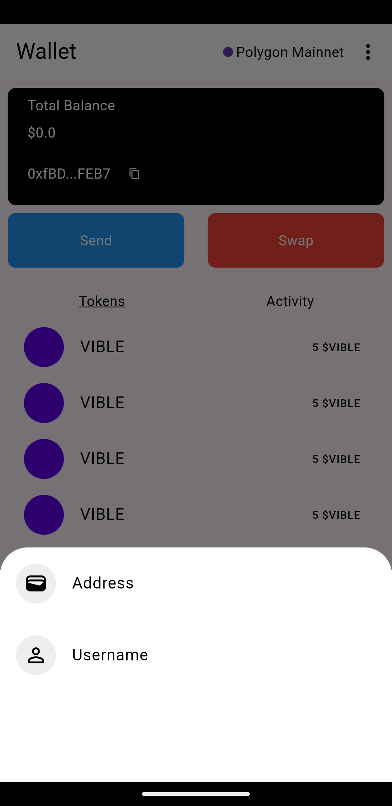
_Select Way To Send Or Transfer_

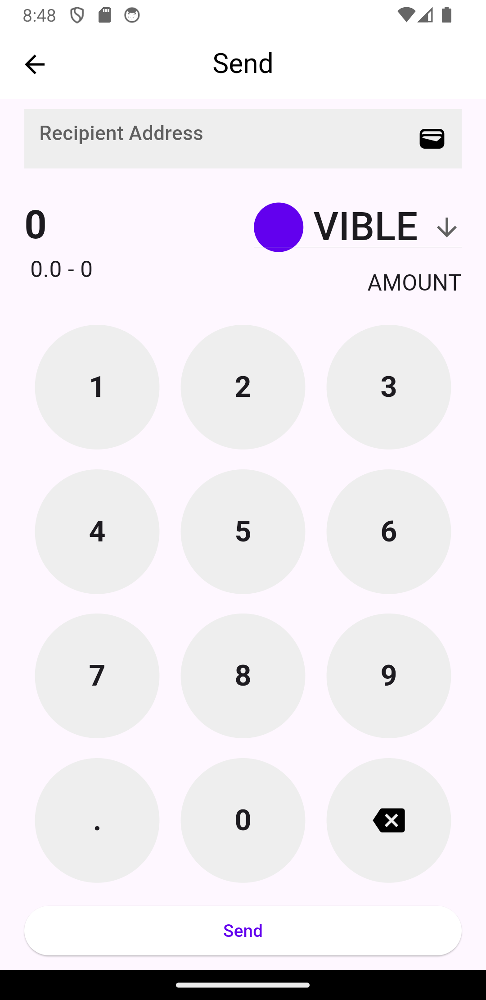
_Send By Address_

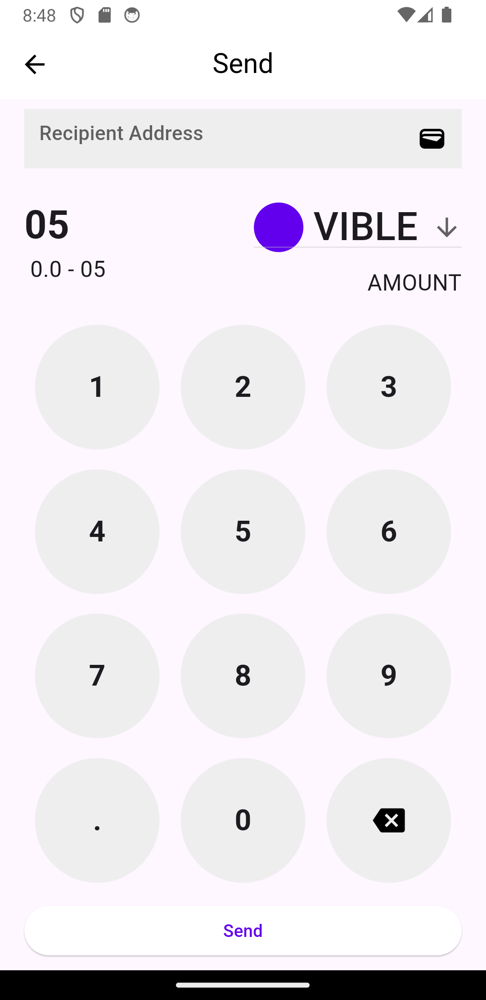
_Send By Address-2_

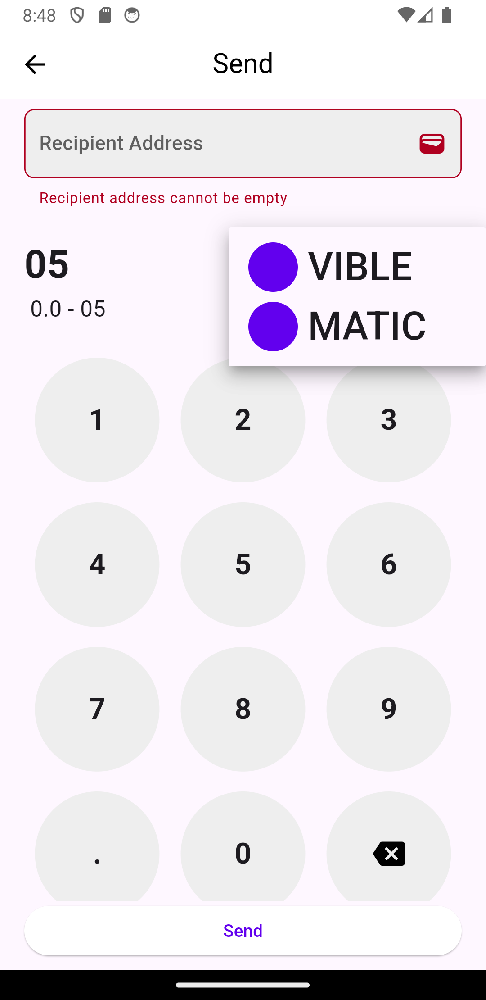
_Send By Address Select Currency_

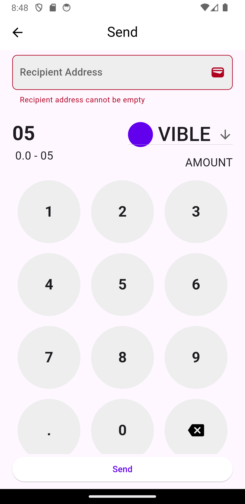
_Send By Address Error_

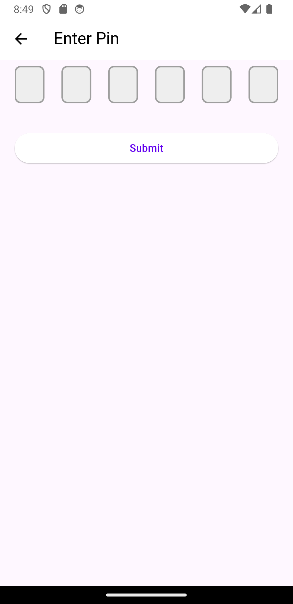
_Enter Pin To Authenticate Transaction_

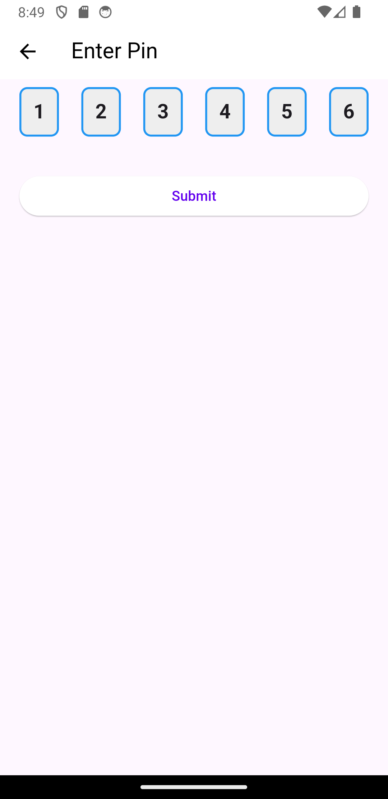
_Enter Pin To Authenticate Transaction Filled_

## Architecture

The Vible Wallet Clone app follows the MVVM (Model-View-ViewModel) architecture.

- **Models:** Represent the data structures and business logic.
- **Views:** UI components such as screens and widgets.
- **ViewModels:** Handle the logic to update the UI and interact with models.

### Key Components

1. **Authentication Module:** Handles user login.
2. **Wallet Module:** Manages wallet creation and storage.
3. **Transaction Module:** Handles transaction operations and history.

## API Reference

### Authentication API

- **Endpoint:** `/user/login`
  - **Method:** POST
  - **Description:** Authenticate user
  - **Parameters:**
    - `mixed`: User's email address
    - `password`: User's password

### Wallet API

- **Endpoint:** `solana/wallet/create`

  - **Method:** POST
  - **Description:** Create a new wallet
  - **Parameters:**
    - `walletName`: Nick-name given to the wallet by the user
    - `network`: Network type (e.g., Polygon, Ethereum)
    - `userPin`: Pin set by the user

- **Endpoint:** `solana/wallet/balance`
  - **Method:** GET
  - **Description:** Get the balance of user's wallet
  - **Parameters:**
    - `network`: Network type (e.g., Polygon, Ethereum)
    - `wallet_address`: User's wallet address whose balance is to be found.

### Transaction API

- **Endpoint:** `solana/wallet/transfer`

  - **Method:** POST
  - **Description:** Send cryptocurrency
  - **Parameters:**
    - `senderAddress`: Sender's wallet address
    - `recipientAddress`: Receiver's wallet address
    - `amount`: Amount to send
    - `network`: Network type (e.g., Polygon, Ethereum)
    - `userPin`: Pin of the user to authenticate the transaction

- **Endpoint:** `solana/wallet/airdrop`
  - **Method:** POST
  - **Description:** Request Airdrop
  - **Parameters:**
    - `walletAddress`: Receiver's wallet address
    - `amount`: Amount to send
    - `network`: Network type (e.g., Polygon, Ethereum)
